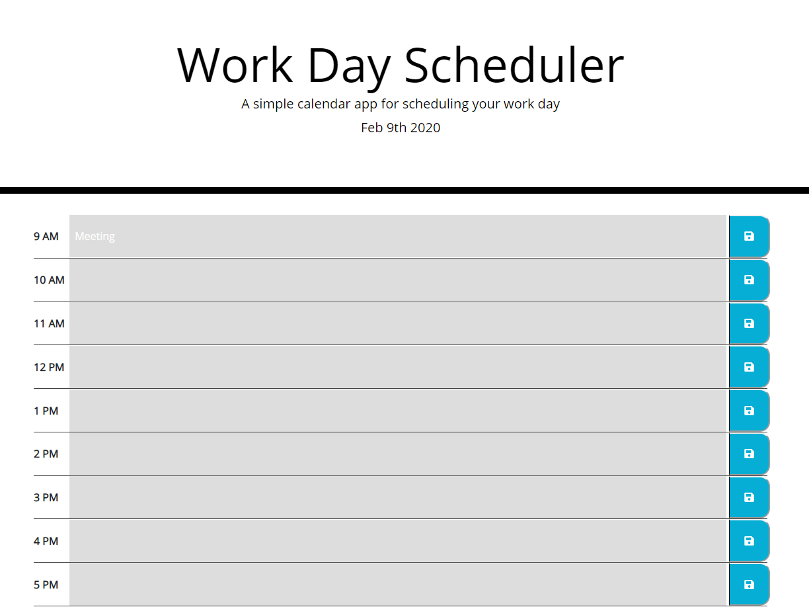

# day-planner
Day Planner uses JavaScript to store a 9am-5pm work schedule in local storage.  It also keeps track of the date and informs you of which scheduled events are in the past, present and future.

screenshot of final project:

link to live demo:
https://kjekcode.github.io/day-planner/
